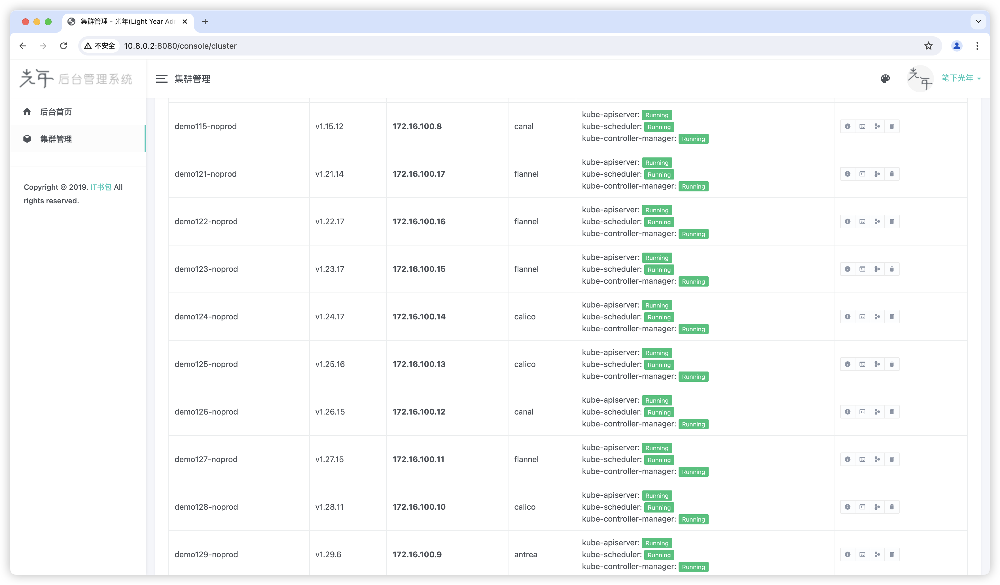

# kok

This project is deploy kubernetes control-plane on k8s.

## Depend-on

### LoadBalancer

Will be used to expose the kube-apiserver service and communicate with apiserver through this IP when adding nodes.

* [metallb](https://github.com/metallb/metallb)

### StorageClass

Will be used to store individual cluster etcd data and certificate files.

* [nfs-subdir-external-provisioner](https://github.com/kubernetes-sigs/nfs-subdir-external-provisioner)
  > `kubectl patch storageclass nfs-client -p '{"metadata": {"annotations":{"storageclass.kubernetes.io/is-default-class":"true"}}}'`

## Quick start

You need a kubernetes cluster first, then deploy this project on this kubernetes.

```shell
sudo modprobe nfs 
sudo modprobe nfsd
docker run --privileged -d --name nfs-server \
--net host \
-e NFS_EXPORT_0='/aaa *(rw,fsid=1,sync,insecure,no_subtree_check,no_root_squash)'  \
-v /Users/peng.liu/temp/nfs:/aaa \
erichough/nfs-server:2.2.1

kind create cluster --name kok --image docker.m.moby.org.cn/kindest/node:v1.30.2
sudo bin/cloud-provider-kind

helm upgrade -i kok ./kok -n kok --create-namespace

# get EXTERNAL-IP and redeploy
helm upgrade -i kok ./kok -n kok --create-namespace \
--set webhookUrl=http://<EXTERNAL-IP>:8080 
```

Now you can open the link to create the cluster
* http://\<EXTERNAL-IP\>:8080/console/cluster

## Implemented
* control-plane deployment
* add node api
* control-plane monitoring
* etcd monitoring
* coredns monitoring
* pod monitoring
* kubelet monitoring
* kube-proxy monitoring
* node monitoring
* cluster event log

## Layout


* https://kubernetes.io/docs/reference/kubernetes-api/
* https://gist.github.com/alaypatel07/92835ab398a342570a3940474590e825