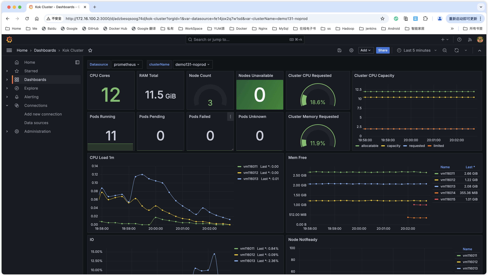

# kok

This project is deploy kubernetes control-plane on k8s. 

Can help you create any version of kubernetes control plane in 1 minute..

```shell
git submodule update --init --remote --recursive
```

## Depend-on

### fluent-operator

Will be used collect control plane logs.

```
helm install fluent-operator --create-namespace -n infra \
--set containerRuntime=containerd \
--set fluentbit.enable=false \
--set fluentbit.input.tail.enable=false \
--set fluentbit.input.systemd.enable=false \
--set fluentbit.filter.kubernetes.enable=false \
--set fluentbit.filter.containerd.enable=false \
--set fluentbit.filter.systemd.enable=false \
https://github.com/fluent/fluent-operator/releases/download/v3.2.0/fluent-operator.tgz
```

### LoadBalancer

Will be used to expose the kube-apiserver service and communicate with apiserver through this IP when adding nodes.

* [MetalLB](https://github.com/metallb/metallb)

* [OpenELB](https://github.com/openelb/openelb)

### StorageClass

Will be used to store individual cluster etcd data and certificate files.

* [nfs-subdir-external-provisioner](https://github.com/kubernetes-sigs/nfs-subdir-external-provisioner)
  > `kubectl patch storageclass nfs-client -p '{"metadata": {"annotations":{"storageclass.kubernetes.io/is-default-class":"true"}}}'`


## Quick start

You need a kubernetes cluster first, then deploy this project on this kubernetes.

```shell
sudo modprobe nfs 
sudo modprobe nfsd
docker run --privileged -d --name nfs-server \
--net host \
-e NFS_EXPORT_0='/kubernetes *(rw,fsid=1,sync,insecure,no_subtree_check,no_root_squash)'  \
-v /data/nfs:/kubernetes \
erichough/nfs-server:2.2.1

kind create cluster --name kok --image docker.m.moby.org.cn/kindest/node:v1.30.2
sudo bin/cloud-provider-kind

helm upgrade -i kok ./kok -n kok-system --create-namespace \
--set prometheus.url=http://<PROMETHEUS EXTERNAL-IP>:9090  \
--set elasticsearch.url=http://<ELASTICSEARCH EXTERNAL-IP>:9200
```

Now you can open the link to create the cluster
* http://\<EXTERNAL-IP\>:8080/console/cluster

## Merge kubeconfig

exec to `kok` Pod.

```shell
touch .kube/config
ls ./data/kubeconfig/*.kubeconfig | xargs -I{} sh -c 'kubecm add -cf {} --context-name $(basename {} .kubeconfig)'

# use control cluster
kubectl config unset current-context

# use controlled cluster
kubectl config get-contexts
kubectl config use-context <Name>
```

## Implemented
* control-plane deployment
* add node api
* control-plane monitoring
* etcd monitoring
* coredns monitoring
* pod monitoring
* kubelet monitoring
* kube-proxy monitoring
* node monitoring
* cluster event log

## Layout




* https://kubernetes.io/docs/reference/kubernetes-api/
* https://gist.github.com/alaypatel07/92835ab398a342570a3940474590e825
* https://iphysresearch.github.io/blog/post/programing/git/git_submodule/